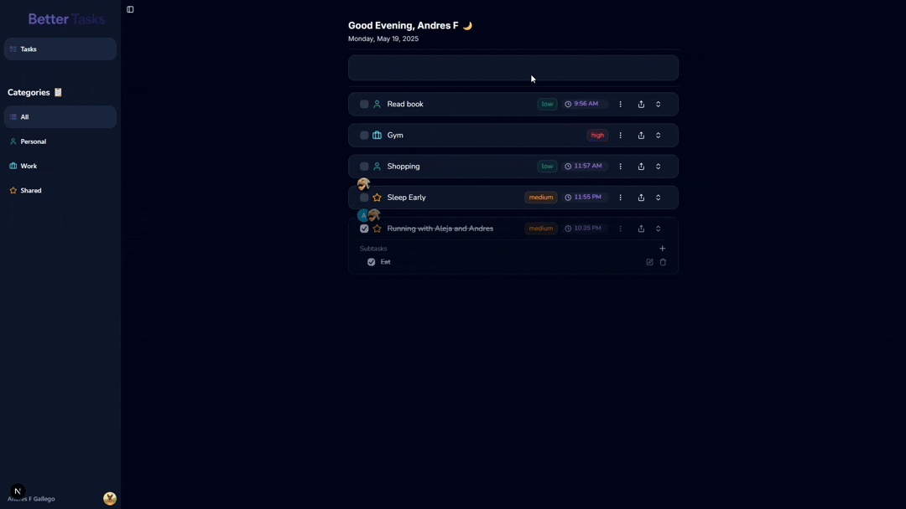

# Better Tasks

A modern task management application designed to help you organize your daily tasks efficiently. Better Tasks provides an intuitive interface for managing your tasks, with powerful features for both individual and team productivity.

## 🔐 Authentication & Security

Better Tasks leverages Clerk for robust authentication and security features:

- **Authentication**: Secure user authentication with multiple sign-in methods
- **Route Protection**: Protected routes ensuring data privacy
- **Middleware**: Advanced middleware for request handling and validation
- **Task Sharing**: Secure task sharing between users
- **User Search**: Efficient user discovery and collaboration

## Live Demo & Repository

[Live Demo](https://manage-my-tasks.vercel.app/)

[Repository](https://github.com/WalkerFGZ/manage-my-tasks)

## 📱 Application Preview

## 🛠️ Tech Stack

- **Framework**: Next.js
- **Language**: TypeScript
- **Styling**: Tailwind CSS
- **UI Components**: shadcn/ui
- **Animations**: Animated shadcn/ui
- **State Management**: React Query
- **Authentication**: Clerk
- **Database**: Supabase
- **Deployment**: Vercel

## 🚀 Features

### Smart Task Management

- Create, edit, and organize tasks effortlessly
- Set priorities and due dates
- Track progress in real-time
- Categorize tasks with custom labels
- Drag-and-drop task organization

### Team Collaboration

- Share tasks with team members
- Real-time updates and notifications
- Comment and discuss on tasks
- Assign responsibilities
- Team activity tracking

### Enhanced User Experience

- Clean, intuitive interface
- Dark/Light mode with persistence
- Responsive design for all devices
- Smooth animations and transitions
- Keyboard shortcuts for power users
- Toast notifications for feedback
- Accessible components (ARIA)
- Visual feedback for user actions
- Dropdown menus and modals

### Cross-Platform Compatibility

- Mobile devices
- Tablets
- Laptops
- Desktop screens

---

## 📱 Responsive Design

Better Tasks works perfectly on:

- Mobile devices
- Tablets
- Laptops
- Desktop screens

## 🎨 UI/UX Features

- Responsive design for all devices
- Dark mode with persistence
- Smooth animations and transitions
- Accessible components (ARIA)
- Visual feedback for user actions
- Toast notifications
- Dropdown menus and modals

## 📄 License

This project is licensed under the MIT License - see the [LICENSE.md](LICENSE.md) file for details.

## 🙏 Acknowledgments

- Next.js Team
- Vercel
- Clerk
- Supabase
- All contributors

## 🔮 Future Roadmap / Ideas

- Migrate to Clerk organizations
- Mobile app development
- Advanced analytics dashboard
- Calendar integration
- API documentation
- Performance optimizations
- Team workspaces
- Custom themes
- Export/Import functionality

Made with ❤️ by [Andres Gallego](https://github.com/WalkerFGZ)
